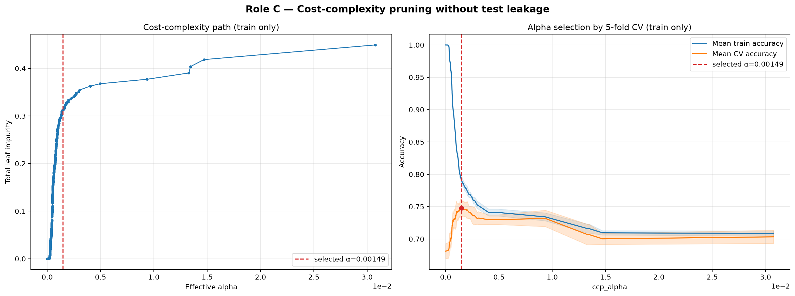
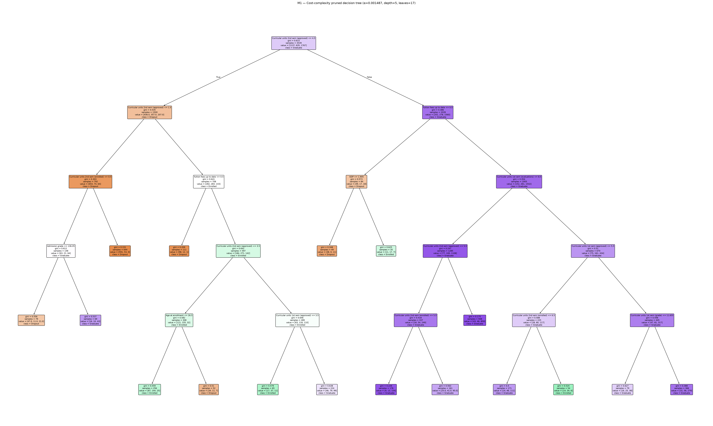
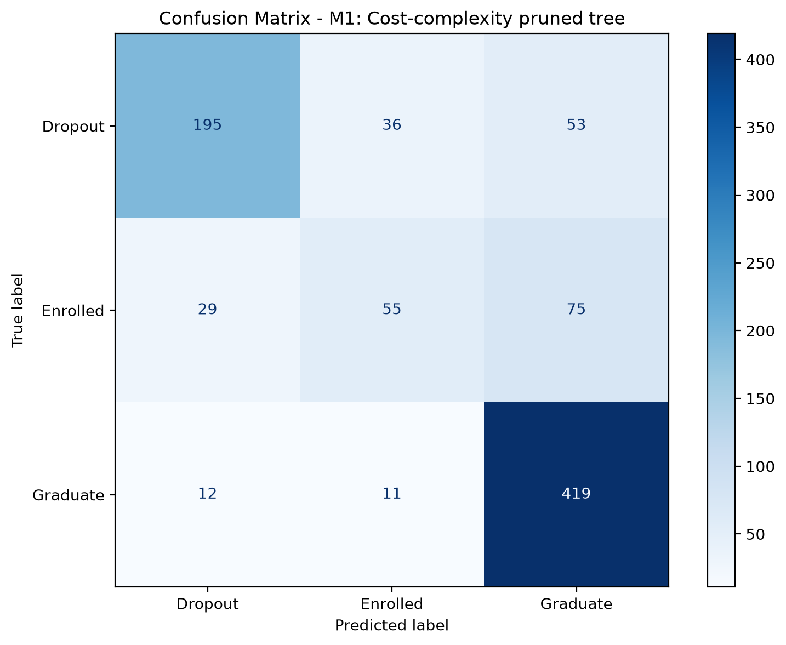

# f.1. Improvement Method 1 — Cost-Complexity Pruning

## Vấn đề của mô hình baseline và mục tiêu cải tiến

Mô hình baseline M0 là một `DecisionTreeClassifier(random_state=42)` không giới hạn độ
sâu. M0 đạt train accuracy bằng **1,000000** nhưng test accuracy chỉ **0,668927**, tạo
generalization gap **0,331073**. Cây có độ sâu **27** và **634 lá**. Đây là bằng chứng rõ
ràng rằng cây đã tiếp tục chia cho tới khi gần như ghi nhớ tập train, làm tăng variance và
khả năng học cả nhiễu thay vì chỉ học quy luật có thể tổng quát hóa.

Mục tiêu của M1 là kiểm tra liệu có thể loại bỏ phần lớn cấu trúc dư thừa mà không làm mất
hiệu năng hay không. Nhóm kết hợp hai hình thức kiểm soát độ phức tạp:

1. **Cost-complexity post-pruning** bằng `ccp_alpha`: một nhánh chỉ được giữ lại khi mức
   giảm impurity mà nó mang lại đủ bù cho chi phí độ phức tạp của các lá bổ sung.
2. **Pre-pruning constraints** bằng `max_depth` và `min_samples_leaf`: giới hạn chiều sâu
   và ngăn các phép chia tạo ra những vùng dữ liệu quá nhỏ, vốn thường có variance cao.

## Giao thức chọn mô hình — không sử dụng test để tuning

Nhóm dùng đúng train/test split chung từ `src.data.get_train_test()`; notebook không tự
split lại và không scale dữ liệu. Tập train gồm 3.539 mẫu × 90 feature và held-out test
gồm 885 mẫu × 90 feature. Mọi bước ngẫu nhiên đều dùng `random_state=42`.

Quy trình được thực hiện theo thứ tự cố định sau:

1. Chạy `cost_complexity_pruning_path(X_train, y_train)` trên train set. Path có **334**
   điểm; sau khi loại alpha cuối (cây tầm thường chỉ còn nút gốc) và loại alpha lặp, còn
   **236** ứng viên.
2. Đánh giá từng `ccp_alpha` bằng
   `StratifiedKFold(n_splits=5, shuffle=True, random_state=42)` **chỉ trên train set**.
   Tiêu chí lựa chọn được chốt trước là mean validation accuracy. Macro-F1 được lưu làm
   chỉ số kiểm tra phụ nhưng không được dùng để thay đổi tiêu chí sau khi xem kết quả.
3. Hai alpha có mean CV accuracy hòa nhau trong tolerance số học `1e-12`; nhóm dùng
   tie-break đã khai báo trước là chọn alpha lớn hơn để ưu tiên cây đơn giản hơn. Alpha
   cuối cùng là **0,0014874613584826332**, với mean CV accuracy **0,747669** và mean CV
   macro-F1 **0,672329**.
4. Giữ cố định alpha trên, chạy grid bắt buộc
   `max_depth ∈ {5, 8, 10, 15}` × `min_samples_leaf ∈ {1, 5, 10, 20}` bằng cùng 5-fold
   CV trên train. Nếu accuracy hòa, tie-break ưu tiên depth nhỏ hơn rồi leaf lớn hơn.
5. Chỉ sau khi khóa toàn bộ cấu hình, fit lại M1 trên full train và gọi helper dùng chung
   `evaluate_model()` **một lần** để đánh giá held-out test. Test accuracy không xuất hiện
   trong pruning path, bảng alpha hay bảng grid và không tham gia bất kỳ quyết định nào.

Quy trình này tuân theo API và cách loại alpha cây một nút trong ví dụ chính thức về
[cost-complexity pruning của scikit-learn](https://scikit-learn.org/1.8/auto_examples/tree/plot_cost_complexity_pruning.html).
Việc đánh giá tổ hợp tham số dùng
[`GridSearchCV`](https://scikit-learn.org/1.8/modules/generated/sklearn.model_selection.GridSearchCV.html)
và các fold phân tầng dùng
[`StratifiedKFold`](https://scikit-learn.org/1.8/modules/generated/sklearn.model_selection.StratifiedKFold.html).

## Kết quả grid search

Bảng dưới trình bày **mean validation accuracy** của đủ 16 cấu hình. Mỗi ô được tính hoàn
toàn trên train folds; không phải test accuracy.

| `max_depth` | `min_samples_leaf=1` | `=5` | `=10` | `=20` |
|---:|---:|---:|---:|---:|
| 5  | 0,741167 | 0,740885 | 0,740603 | **0,748235** |
| 8  | 0,747103 | 0,747386 | 0,747104 | 0,745689 |
| 10 | 0,747951 | 0,747669 | 0,747387 | 0,746536 |
| 15 | 0,747669 | 0,747669 | 0,747387 | 0,746536 |

Cấu hình thắng grid là:

- `ccp_alpha = 0,0014874613584826332`;
- `max_depth = 5`;
- `min_samples_leaf = 20`;
- `random_state = 42`;
- mean CV accuracy = **0,748235 ± 0,015124**;
- mean CV macro-F1 = **0,654465 ± 0,031242**.

Điểm accuracy của cấu hình thắng chỉ cao hơn cấu hình `max_depth=10,
min_samples_leaf=1` khoảng **0,000284**. Vì vậy, ưu thế định lượng trong CV là nhỏ; giá trị
thực tế lớn nhất của cấu hình được chọn là cây cực kỳ gọn. Việc báo cáo cả độ lệch chuẩn
giúp tránh diễn giải chênh lệch nhỏ này như một bằng chứng tuyệt đối rằng một cấu hình luôn
tốt hơn các cấu hình lân cận.

*Hình f.1a. Bên trái là tổng impurity của các lá theo effective alpha; bên phải là mean
train/CV accuracy cùng độ lệch chuẩn qua năm folds. Đường đỏ đánh dấu alpha đã chọn. Không
có test curve trong hình để tránh tuning trên test.*

## Kết quả held-out test và so sánh M0–M1

| Chỉ số | M0 baseline | M1 pruning | M1 − M0 |
|---|---:|---:|---:|
| Train accuracy | 1,000000 | 0,768014 | −0,231986 |
| Test accuracy | 0,668927 | **0,755932** | **+0,087006** |
| Error rate | 0,331073 | **0,244068** | −0,087006 |
| Precision macro | 0,607642 | **0,710494** | +0,102852 |
| Recall macro | 0,609310 | **0,660165** | +0,050855 |
| F1 macro | 0,608271 | **0,672925** | +0,064654 |
| ROC-AUC macro (OvR) | 0,719456 | **0,847692** | +0,128237 |
| Recall Dropout | 0,679577 | **0,686620** | +0,007042 |
| Recall Enrolled | **0,383648** | 0,345912 | −0,037736 |
| Recall Graduate | 0,764706 | **0,947964** | +0,183258 |
| Tree depth | 27 | **5** | −22 |
| Number of leaves | 634 | **17** | −617 |

M1 trả lời trực tiếp câu hỏi thí nghiệm: **cây nhỏ hơn rất nhiều không những không mất hiệu
năng mà còn tổng quát hóa tốt hơn trên held-out test**. Test accuracy tăng **8,70 điểm phần
trăm**, error rate giảm tương ứng từ 33,11% xuống 24,41%, macro-F1 tăng 6,47 điểm phần
trăm và macro ROC-AUC tăng 12,82 điểm phần trăm.

Trong khi đó, độ sâu giảm **81,48%** (27 → 5) và số lá giảm **97,32%** (634 → 17), tức M1
có ít lá hơn khoảng **37,3 lần**. Generalization gap giảm từ **0,331073** xuống chỉ
**0,012081**. Train accuracy giảm mạnh không phải là lỗi: M0 đạt 100% vì học thuộc train,
còn M1 chấp nhận thêm bias để giảm variance. Việc test accuracy đồng thời tăng cho thấy
những nhánh bị loại chủ yếu mô tả nhiễu hoặc các mẫu quá đặc thù, chứ không phải quy luật
có khả năng tổng quát hóa.

*Hình f.1b. Toàn bộ cây M1 sau pruning: depth 5, 17 lá. Khác với cây M0 có 634 lá, hình
này có thể đọc trực tiếp và dùng để giải thích đường quyết định.*

*Hình f.1c. Confusion matrix của M1 trên 885 mẫu test: dự đoán đúng 195/284 Dropout,
55/159 Enrolled và 419/442 Graduate.*

## Diễn giải theo từng lớp và giới hạn

Sự cải thiện không phân bố đều giữa ba lớp. Recall Graduate tăng rất mạnh lên **0,947964**
và recall Dropout tăng nhẹ lên **0,686620**, nhưng recall Enrolled giảm từ **0,383648**
xuống **0,345912**. Trong 159 sinh viên Enrolled, M1 nhận đúng 55, nhầm 29 thành Dropout
và nhầm 75 thành Graduate. Do tiêu chí chọn trước là accuracy, cấu hình được phép ưu tiên
phân loại tốt lớp Graduate chiếm đa số nếu điều đó làm tăng tổng số dự đoán đúng. Đây là
một đánh đổi thật, không nên bị che khuất bởi accuracy tổng; nó cũng tạo động lực cho cải
tiến xử lý class imbalance ở mục f.2.

Các kết quả trên đến từ một held-out split cố định, nên chưa chứng minh M1 sẽ luôn tăng
8,70 điểm phần trăm trên mọi mẫu dữ liệu tương lai. Độ lệch chuẩn CV và khoảng cách nhỏ
giữa nhiều cấu hình grid cho thấy lựa chọn chính xác có thể thay đổi theo mẫu train. Tuy
nhiên, kết luận về độ phức tạp là chắc chắn đối với mô hình đã fit: M1 thực sự có độ sâu 5
và 17 lá, và mọi quyết định siêu tham số đều được thực hiện trước khi mở test.

## Kết luận Improvement Method 1

Cost-complexity pruning kết hợp giới hạn depth/leaf đã giải quyết trực tiếp điểm yếu lớn
nhất của M0. Cây giảm 97,32% số lá, dễ đọc và ít nhạy với nhiễu hơn, đồng thời tăng tất cả
các metric tổng hợp chính trên held-out test. Vì vậy M1 là một cải tiến thành công về cả
**khả năng tổng quát hóa** lẫn **khả năng diễn giải**. Hạn chế còn lại là recall Enrolled
giảm; nếu mục tiêu triển khai ưu tiên phát hiện mọi sinh viên chưa tốt nghiệp, cần cân nhắc
metric lựa chọn theo lớp hoặc kỹ thuật cân bằng lớp thay vì chỉ tối đa hóa accuracy.
