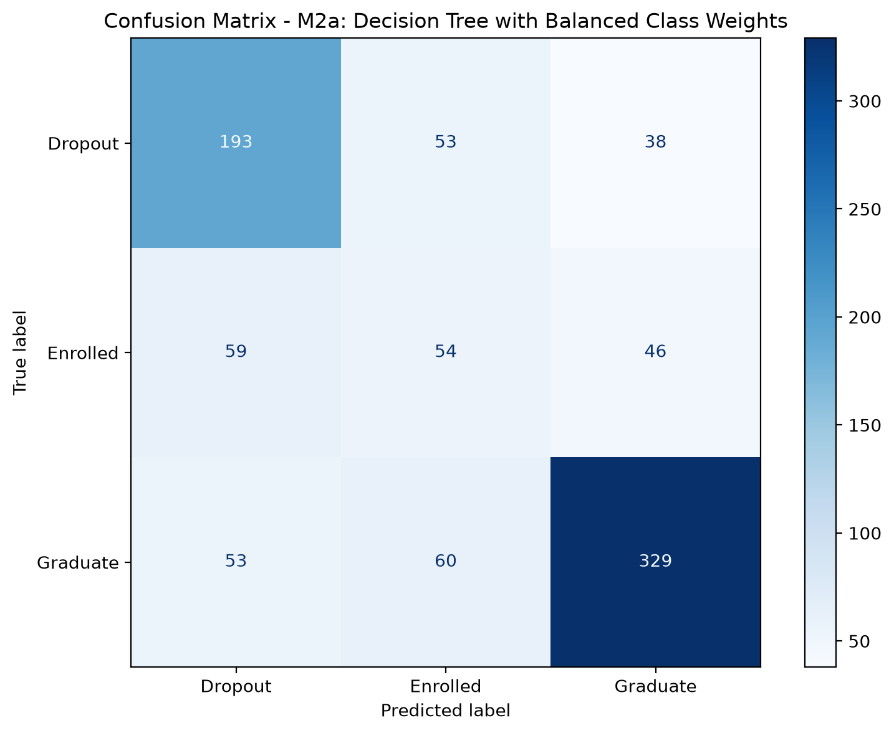
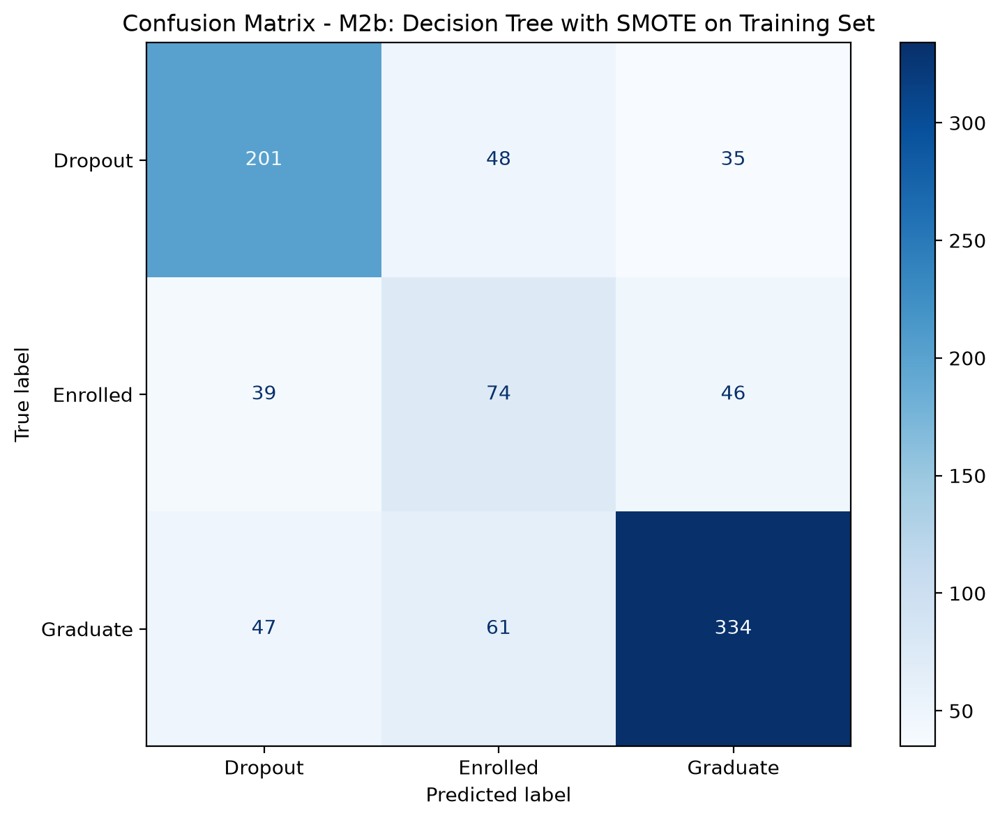
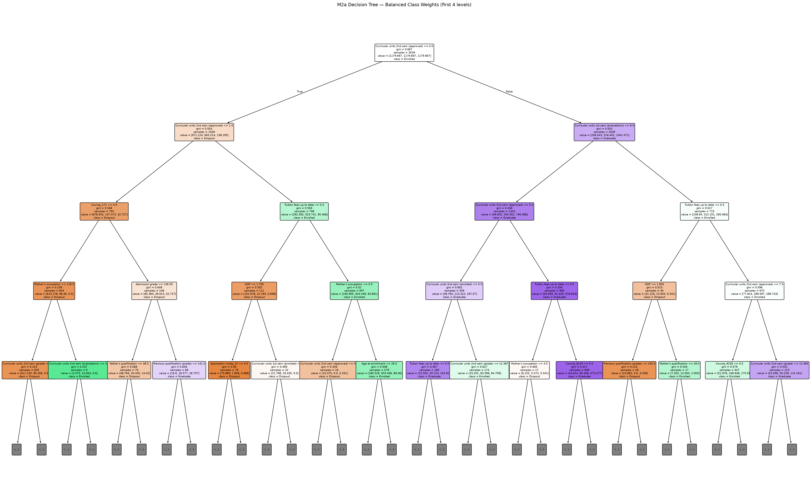
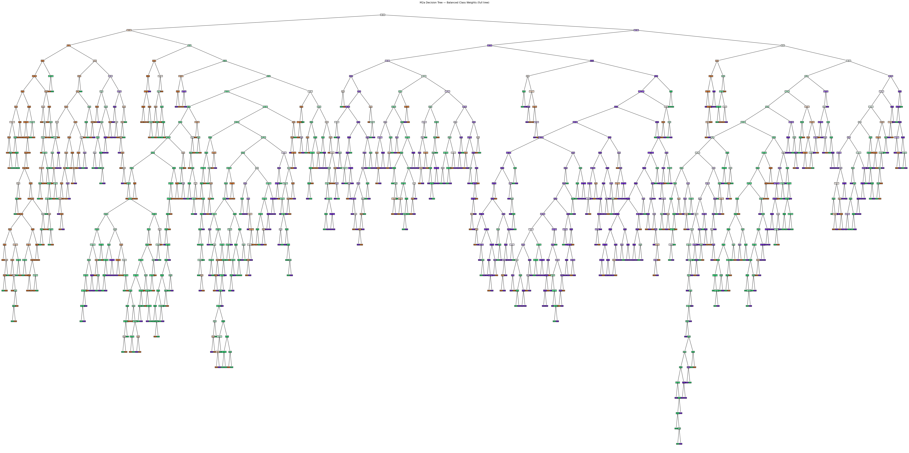
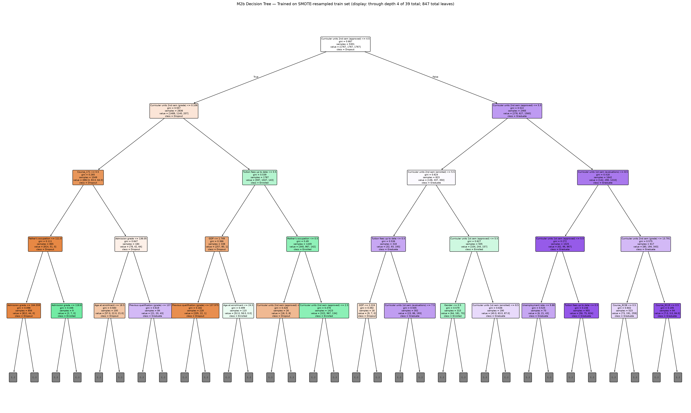

# f.2. Improvement Method 2 — Class Imbalance

## Vấn đề của M0 và mục tiêu cải tiến

Target của dataset có phân bố không đều: Graduate là lớp lớn nhất, tiếp theo là Dropout,
còn Enrolled là lớp thiểu số. Trên held-out test gồm 885 sinh viên, M0 nhận đúng 338/442
Graduate và 193/284 Dropout, nhưng chỉ nhận đúng **61/159 Enrolled**. Vì vậy, dù test
accuracy của M0 là **0,668927**, recall Enrolled chỉ **0,383648**. Đây là hạn chế quan
trọng nếu mục tiêu ứng dụng là nhận diện cả những sinh viên chưa tốt nghiệp đúng hạn, thay
vì chỉ tối đa hóa số dự đoán đúng trên lớp đa số.

M2 kiểm tra hai cách thay đổi mức độ chú ý của decision tree tới các lớp ít mẫu. Cả hai
thí nghiệm đều gọi cùng một `get_train_test()` từ `src.data`, dùng 3.539 mẫu train, 885
mẫu held-out test, 90 feature sau one-hot và `random_state=42`. Không có scale hoặc split
riêng trong notebook.

*Kết quả trong tài liệu này được tạo từ một lần chạy `notebooks/04_improve_imbalance.ipynb`
với môi trường: Python 3.14.0, numpy 2.3.4, pandas 2.3.3, scikit-learn 1.9.0,
matplotlib 3.11.1, imbalanced-learn 0.14.2. Notebook đã chạy lại từ kernel sạch sau khi xóa
hai dòng `M2a`/`M2b` cũ trong `outputs/results.csv`, và mọi assert/guardrail nội bộ (chống
leakage, đúng cấu hình, `error_rate == 1 - test_acc`, macro metrics trong `[0, 1]`) đều PASS.
Số liệu bên dưới khớp tuyệt đối với `outputs/results.csv`,
`outputs/classification_report_M2a.txt` và `outputs/classification_report_M2b.txt`.*

## Hai phương pháp cân bằng lớp

### M2a — `class_weight='balanced'`

M2a dùng:

```python
DecisionTreeClassifier(class_weight='balanced', random_state=42)
```

Scikit-learn tự tăng trọng số của các lớp có ít quan sát khi tính tiêu chí chia node. M2a
vẫn fit trên đúng tập train gốc; không tạo thêm mẫu dữ liệu nào.

### M2b — SMOTE chỉ trên tập train

M2b dùng `SMOTE(random_state=42)` sau khi đã có split chung:

```python
X_train_smote, y_train_smote = SMOTE(
    sampling_strategy="auto", random_state=42, k_neighbors=5
).fit_resample(X_train, y_train)
DecisionTreeClassifier(random_state=42).fit(X_train_smote, y_train_smote)
```

Trước SMOTE, train có 1.137 Dropout, 635 Enrolled và 1.767 Graduate. Sau resampling,
mỗi lớp có 1.767 mẫu, tức 5.301 mẫu train (1.762 mẫu synthetic). **SMOTE không được áp
dụng lên toàn bộ dataset và không được áp dụng lên test set.** Notebook xác nhận bằng
guardrail hash SHA-256: `X_test`, `y_test` và `X_train` gốc giữ nguyên bit-for-bit trước
và sau khi gọi `fit_resample()`; vì vậy các metric bên dưới không bị rò rỉ từ dữ liệu
tổng hợp.

## Kết quả held-out test

| Chỉ số | M0 baseline | M2a class weight | M2b SMOTE-train | M2a − M0 | M2b − M0 |
|---|---:|---:|---:|---:|---:|
| Test accuracy | 0,668927 | 0,650847 | **0,688136** | −0,018079 | **+0,019209** |
| Error rate | 0,331073 | 0,349153 | **0,311864** | +0,018079 | **−0,019209** |
| Recall Dropout | 0,679577 | 0,679577 | **0,707746** | +0,000000 | **+0,028169** |
| Recall Enrolled | 0,383648 | 0,339623 | **0,465409** | −0,044025 | **+0,081761** |
| Recall Graduate | **0,764706** | 0,744344 | 0,755656 | −0,020362 | −0,009050 |
| Precision macro | 0,607642 | 0,584250 | **0,636513** | −0,023392 | **+0,028871** |
| Recall macro | 0,609310 | 0,587848 | **0,642937** | −0,021462 | **+0,033627** |
| F1 macro | 0,608271 | 0,585409 | **0,638747** | −0,022862 | **+0,030475** |
| Tree depth / leaves | 27 / 634 | 28 / 696 | **39 / 847** | — | — |

### Precision theo từng lớp (đọc từ classification report, chưa có trong schema `results.csv`)

| Lớp | M2a precision | M2b precision | M2a F1 | M2b F1 |
|---|---:|---:|---:|---:|
| Dropout | 0,6328 | **0,7003** | 0,6553 | **0,7040** |
| Enrolled | 0,3234 | **0,4044** | 0,3313 | **0,4327** |
| Graduate | 0,7966 | 0,8048 | 0,7696 | 0,7795 |

Điểm đáng chú ý: M2b không chỉ tăng recall Enrolled mà còn tăng **precision** Enrolled
(0,3234 → 0,4044). Tức khi M2b dự đoán một sinh viên là "Enrolled", xác suất dự đoán đó
đúng cũng cao hơn M2a, không chỉ đơn thuần là M2b "dự đoán Enrolled nhiều hơn một cách bừa
bãi" để đổi lấy recall cao hơn. Đây là lý do F1 Enrolled của M2b (0,4327) vượt xa M2a
(0,3313).



*Hình f.2a. Confusion matrix M2a trên 885 mẫu held-out test.*



*Hình f.2b. Confusion matrix M2b trên cùng held-out test.*



*Hình f.2c. Cây M2a hiển thị đến độ sâu 4 (root = độ sâu 0), trên tổng số 28 tầng thật
của cây. Thay đổi trọng số lớp có thể thay đổi Gini và cấu trúc split, nên đây vẫn là một
cấu hình cây quyết định cần được trình bày, không chỉ là một tham số bổ sung.*



*Hình f.2d. Toàn bộ cây M2a (28 tầng, 696 lá). Ảnh này không dùng để đọc luật quyết định
mà minh họa quy mô thực tế của cây — gần tương đương độ phức tạp của M0 (27 tầng, 634 lá),
cho thấy `class_weight='balanced'` không làm cây đơn giản hơn, chỉ thay đổi cách phân bổ
trọng số khi chọn split.*



*Hình f.2e. Cây M2b hiển thị đến độ sâu 4, trên tổng số 39 tầng thật, 847 lá — cây được
train trên tập đã SMOTE (5.301 dòng) nhưng được đánh giá trên tập test gốc.*


*Hình f.2f. Toàn bộ cây M2b (39 tầng, 847 lá) — sâu và nhiều lá hơn hẳn M0 và M2a, vì tập
train sau SMOTE có 5.301 dòng thay vì 3.539 dòng, cho cây nhiều cơ hội chia nhỏ hơn.*

## So sánh M2a và M2b, đặc biệt với lớp Enrolled

M2a không đạt mục tiêu của thí nghiệm trên split này. Test accuracy giảm **1,81 điểm phần
trăm** so với M0; đồng thời recall Dropout không đổi, recall Enrolled giảm **4,40 điểm** và
recall Graduate giảm **2,04 điểm**. Vì cả accuracy lẫn recall của các lớp cần ưu tiên đều
giảm hoặc không đổi, không có bằng chứng từ held-out test rằng `class_weight='balanced'`
một mình cải thiện mô hình M0 trong cấu hình này.

M2b hiệu quả hơn rõ rệt. Recall Enrolled tăng từ **0,383648** lên **0,465409**, tương ứng
nhận đúng khoảng 74/159 thay vì 61/159 sinh viên Enrolled trên test. Đồng thời, recall
Dropout tăng từ **0,679577** lên **0,707746** (khoảng 201/284 thay vì 193/284). Recall
Graduate chỉ giảm nhẹ từ 0,764706 xuống 0,755656. Các macro metric cũng tăng: macro-F1
từ 0,608271 lên 0,638747 và macro recall từ 0,609310 lên 0,642937.

Kết quả này phù hợp với mục đích của SMOTE: lớp Enrolled có ít quan sát gốc nhất trong
train; resampling tạo thêm điểm tổng hợp trong vùng đặc trưng của lớp này để cây có nhiều
cơ hội tìm split phân biệt Enrolled với hai lớp còn lại. Đây là diễn giải về cơ chế của
thí nghiệm, không phải kết luận nhân quả rằng mọi dataset hoặc mọi split đều sẽ có cùng
mức tăng. M2b có cây sâu 39 và 847 lá, nên cải thiện recall không đồng nghĩa cây đơn giản
hơn; mục tiêu của M2 là cân bằng hiệu năng theo lớp, không phải pruning.

## Hạn chế: vanilla SMOTE trên dữ liệu categorical mã hóa số

`src/data.py` chỉ one-hot 4 nhóm cột (`Marital Status`, `Application mode`, `Course`,
`Previous qualification`); các cột categorical cardinality cao khác — `Mother's
qualification`, `Father's qualification`, `Mother's occupation`, `Father's occupation`,
`Nacionality` (nominal, không có thứ tự) và `Application order` (ordinal) — vẫn giữ dạng mã
số nguyên (xem `docs/feature_types.md`). SMOTE gốc coi mọi feature là liên tục và nội suy
tuyến tính giữa các điểm láng giềng, nên về lý thuyết có thể tạo ra giá trị không tương ứng
với category thật nào.

Notebook đo trực tiếp hiện tượng này trên 1.762 hàng synthetic mà M2b thực sự dùng để train:

*Bảng 1: Kiểm tra sinh category lạ trên 6 cột mã số nguyên (Nominal/Ordinal)*

| Cột | Dtype | Tỷ lệ vi phạm giá trị phân số | Tỷ lệ sinh ra mã số lạ ngoài tập gốc (`frac_out_of_train_vocab`) |
|---|---|---|---|
| Mother's qualification | nominal | 0,0% | 3,01% |
| Father's qualification | nominal | 0,0% | 2,89% |
| Mother's occupation | nominal | 0,0% | 1,19% |
| Father's occupation | nominal | 0,0% | 2,04% |
| Nacionality | nominal | 0,0% | 2,38% |
| Application order | ordinal | 0,0% | 0,00% |

*Bảng 2: Phân bố lỗi nội suy trên 4 nhóm cột One-hot (đo trên 1.762 mẫu synthetic)*

| Nhóm cột (One-hot) | All-zero (`sum=0`) | Đa category (`sum>1`) | Chứa phân số (`fractional`) | Vi phạm count (`active_count_violation`) | Hợp lệ (`valid_one_hot`) |
|---|---|---|---|---|---|
| Marital Status | 14,7% | 0,0% | 0,0% | 14,7% | 85,3% |
| Application mode | 65,4% | 0,0% | 0,0% | 65,4% | 34,6% |
| **Course** | **83,0%** | 0,0% | 0,0% | **83,0%** | 17,0% |
| Previous qualification | 24,8% | 0,0% | 0,0% | 24,8% | 75,2% |

Hai nhóm kết quả cần đọc khác nhau:

- **Với 6 cột giữ mã số**, phép đo không phát hiện giá trị thập phân nào trong dữ liệu
  synthetic. Kết quả này không được diễn giải là "SMOTE không ảnh hưởng các cột này" một
  cách chắc chắn: nhiều khả năng giá trị nội suy đã bị **cắt cụt (truncate)**/ép kiểu về số
  nguyên trong quá trình `fit_resample()` xử lý dtype của cột, nên phép đo ở mức giá trị số
  không phát hiện được. Ngay cả khi giá trị luôn là số nguyên, mã số đó vẫn có thể không
  tương ứng với category thật nào nếu quá trình nội suy/cắt cụt không bảo toàn danh tính
  category — đây là giới hạn của phép đo, không phải bằng chứng loại trừ vấn đề.
- **Với 4 nhóm one-hot**, phép đo cho kết quả rõ ràng và định lượng được: `imbalanced-learn`
  0.14.2 khôi phục dtype DataFrame đầu ra về đúng dtype cột đầu vào (`ArraysTransformer.astype`).
  Vì các cột dummy do `src/data.py` tạo ra có dtype là `int`, các giá trị nội suy phân số của
  vanilla SMOTE bị **cắt cụt (truncate, không phải làm tròn)** về integer — `.astype(int)`
  luôn cắt phần thập phân về phía 0, không làm tròn tới số gần nhất. Với phép nội suy giữa hai
  vector one-hot khác category, các thành phần phân số gần như luôn bị cắt về 0. Khi đó, toàn bộ (100%) vector
  vi phạm là all-zero (không có category nào hoạt động), chứ không phải là "pha trộn nhiều category". Điều này giải thích
  vì sao `Course` có tới 83,0% hàng synthetic vi phạm tổng bằng 1. Đây là bằng chứng cụ thể
  rằng vanilla SMOTE tạo ra các representation categorical không hợp lệ.

Đây là **hạn chế đã biết** của vanilla SMOTE khi áp dụng cho biểu diễn dữ liệu hỗn hợp
(mixed representation); tài liệu chính thức của `imbalanced-learn` khuyến nghị `SMOTENC`
cho trường hợp có cả feature liên tục và categorical. Nhóm **giữ nguyên vanilla `SMOTE`**
cho M2b vì đây đúng là kỹ thuật được yêu cầu trong đề bài, và pipeline chung của dự án
(`src/data.py`) không thuộc phạm vi Role D để chỉnh sửa. Kết quả M2b trong tài liệu này cần
được đọc với hạn chế trên: cải thiện recall/precision đo được là thật trên held-out test,
nhưng một phần dữ liệu train mà cây học từ đó không phải là các sinh viên "hợp lệ" theo
đúng nghĩa của các cột categorical.

## Đánh đổi accuracy và recall

Trong bài toán mất cân bằng lớp, accuracy tổng không thể là tiêu chí duy nhất. Một mô hình
có thể giảm accuracy vì bớt thiên vị Graduate để dự đoán đúng hơn các lớp ít mẫu; khi đó
phải xem recall từng lớp thay vì tiếp tục tối ưu chỉ để đưa accuracy quay về bằng M0.

M2a là ví dụ rằng đánh đổi này không tự động có lợi: accuracy giảm và recall Enrolled cũng
giảm, nên kết quả cần được báo cáo thẳng thay vì chọn lọc chỉ các con số thuận lợi. Ngược
lại, M2b không phải đánh đổi accuracy lấy recall trong held-out split hiện tại: nó tăng
đồng thời test accuracy, recall Dropout và recall Enrolled; chi phí là recall Graduate
giảm nhẹ 0,90 điểm phần trăm. Vì vậy, nếu ưu tiên phát hiện sinh viên Dropout/Enrolled,
M2b là lựa chọn tốt hơn M0 và M2a trên held-out split hiện tại.

Các kết quả chỉ được đo trên một held-out split cố định, và phần dữ liệu train synthetic
của M2b có hạn chế categorical đã nêu ở trên. Trước khi triển khai thực tế, cần đánh giá
thêm trên các split/cohort khác, cân nhắc `SMOTENC` như một thí nghiệm bổ sung, và xem xét
fairness đối với các nhóm nhạy cảm trong dataset. Với split chung của dự án và trong phạm vi
thí nghiệm này, M2b trả lời tích cực câu hỏi của cải tiến: lớp thiểu số Enrolled và lớp
Dropout được nhận diện tốt hơn khi SMOTE chỉ được thực hiện trên tập train.

## Kết luận Improvement Method 2

`class_weight='balanced'` (M2a) không cải thiện M0 trên held-out test này. SMOTE trên tập
train (M2b) tăng recall Enrolled **8,18 điểm phần trăm**, recall Dropout **2,82 điểm phần
trăm**, đồng thời tăng precision Enrolled từ 0,3234 lên 0,4044, và giảm error rate từ
0,331073 xuống 0,311864. Do đó nhóm chọn M2b là cấu hình cân bằng lớp thành công hơn trong
phạm vi thí nghiệm này; phần báo cáo vẫn giữ M2a để minh bạch rằng không phải mọi kỹ thuật
cân bằng lớp đều tạo ra cải thiện với cùng dữ liệu và cùng mô hình, đồng thời công khai hạn
chế categorical của vanilla SMOTE thay vì chỉ trình bày các con số thuận lợi.

## Tài liệu tham khảo

- Chawla, N. V., Bowyer, K. W., Hall, L. O., & Kegelmeyer, W. P. (2002). SMOTE: synthetic minority over-sampling technique. *Journal of artificial intelligence research*, 16, 321-357.
- API Tham khảo `SMOTE`, Tài liệu `imbalanced-learn 0.14.2`: [imbalanced-learn.org/stable/references/generated/imblearn.over_sampling.SMOTE.html](https://imbalanced-learn.org/stable/references/generated/imblearn.over_sampling.SMOTE.html)
- `imbalanced-learn 0.14.2` Over-sampling: [imbalanced-learn.org/stable/over_sampling.html](https://imbalanced-learn.org/stable/over_sampling.html)
