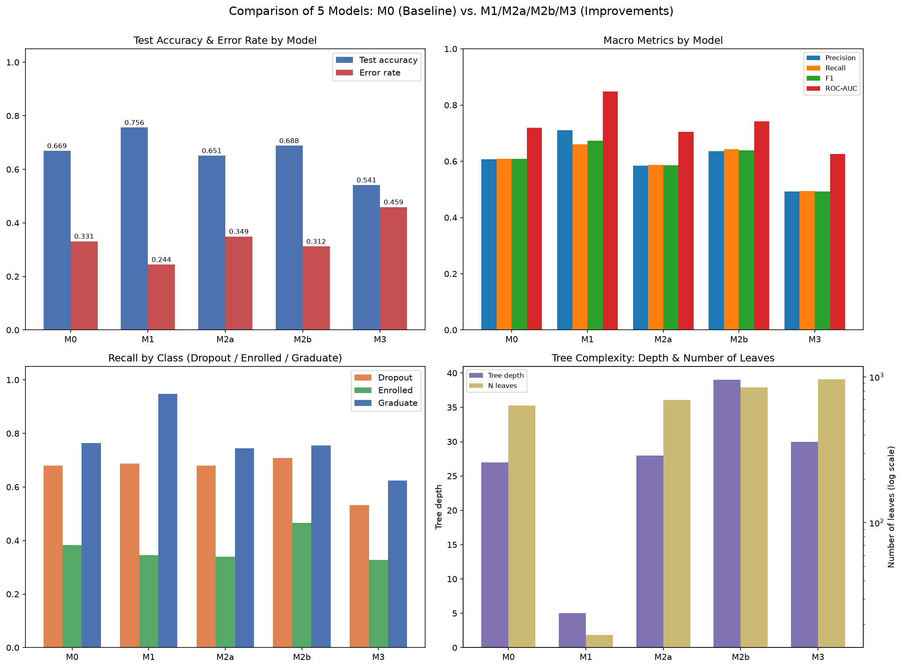

# Bản nháp báo cáo — Mục g (Comparison of Results) & h (Conclusion)

> Viết bởi Role A, sau khi B/C/D/E đã hoàn thành M0–M3 và `outputs/results.csv` có đủ 5
> dòng. Số liệu lấy trực tiếp từ `outputs/results.csv` (qua `notebooks/06_comparison.ipynb`)
> và đối chiếu với các bản nháp `docs/report_draft_f1_pruning.md`,
> `docs/report_draft_f2_imbalance.md`, `notebooks/05_improve_features.ipynb`. Đây là **bản
> nguồn tiếng Việt đã fact-check** cho các section g/h trong `docs/report/sections/`;
> dự án dùng LaTeX, không còn dùng quy trình Google Doc cũ.

---

## g. Comparison of Results

### Bảng so sánh tổng hợp

| Model | Mô tả | Test acc | Error rate | F1 macro | ROC-AUC macro | Recall Dropout | Recall Enrolled | Recall Graduate | Depth | Leaves |
|---|---|---:|---:|---:|---:|---:|---:|---:|---:|---:|
| **M0** | Baseline, không giới hạn | 0,6689 | 0,3311 | 0,6083 | 0,7195 | 0,6796 | 0,3836 | 0,7647 | 27 | 634 |
| **M1** | Cost-complexity pruning | **0,7559** | **0,2441** | **0,6729** | **0,8477** | 0,6866 | 0,3459 | **0,9480** | **5** | **17** |
| **M2a** | `class_weight='balanced'` | 0,6508 | 0,3492 | 0,5854 | 0,7053 | 0,6796 | 0,3396 | 0,7443 | 28 | 696 |
| **M2b** | SMOTE (chỉ trên train) | 0,6881 | 0,3119 | 0,6387 | 0,7421 | **0,7077** | **0,4654** | 0,7557 | 39 | 847 |
| **M3** | Dự báo sớm (bỏ 12 cột HK) | 0,5412 | 0,4588 | 0,4931 | 0,6254 | 0,5317 | 0,3270 | 0,6244 | 30 | 963 |

*Hình g.1. Bốn panel so sánh M0-M1-M2a-M2b-M3 trên cùng held-out test (885 mẫu). Trên-trái:
test accuracy và error rate — M1 cao nhất, M3 thấp nhất. Trên-phải: 4 macro metric (Precision/
Recall/F1/ROC-AUC) — M1 dẫn đầu ở cả 4. Dưới-trái: recall theo từng lớp — M2b vượt trội ở
Dropout và Enrolled, M1 vượt trội ở Graduate. Dưới-phải: độ phức tạp cây (depth, số leaf ở
thang log) — M1 vượt trội, gọn hơn hẳn 4 model còn lại.*

Bảng đầy đủ (16 cột) lưu tại `outputs/comparison_table.csv`.

### So sánh từng cải tiến với baseline

**M1 (Pruning) cải thiện gần như mọi chỉ số tổng hợp.** Test accuracy tăng từ 0,6689 lên
0,7559 (**+8,70 điểm phần trăm**), error rate giảm từ 33,11% xuống 24,41%, F1 macro tăng
6,47 điểm phần trăm, ROC-AUC macro tăng 12,82 điểm phần trăm. Đồng thời độ phức tạp giảm
mạnh: độ sâu 27→5, số lá 634→17 (**ít hơn khoảng 37 lần**). Đây là kết quả hiếm gặp trong
thực hành: cải tiến vừa tăng hiệu năng tổng quát hoá, vừa tăng khả năng diễn giải, không hề
đánh đổi. Cái giá duy nhất là recall Enrolled giảm nhẹ (0,3836→0,3459, −3,77 điểm) vì tiêu
chí chọn `ccp_alpha`/`max_depth`/`min_samples_leaf` được chốt trước là accuracy trên CV, nên
cấu hình được phép ưu tiên lớp đa số (Graduate) nếu điều đó giúp tổng số dự đoán đúng nhiều
hơn.

**M2 (Class Imbalance) cho hai kết quả trái chiều, đúng như bản chất "thử nghiệm" của cải
tiến này.** M2a (`class_weight='balanced'`) **không cải thiện** M0 trên tập test này: test
accuracy giảm 1,81 điểm phần trăm, và ngay cả recall Enrolled — chỉ số mà kỹ thuật này nhắm
tới — cũng giảm (0,3836→0,3396). Ngược lại, M2b (SMOTE chỉ trên train) cải thiện đồng thời
cả accuracy tổng (+1,92 điểm) lẫn recall hai lớp khó nhất: recall Dropout tăng 2,82 điểm,
recall Enrolled tăng **8,18 điểm phần trăm** (61/159 → 74/159 sinh viên Enrolled được nhận
đúng), đổi lại recall Graduate chỉ giảm nhẹ 0,91 điểm. M2b còn tăng cả precision Enrolled
(0,3234→0,4044), nghĩa là mô hình không chỉ "đoán Enrolled nhiều hơn một cách bừa bãi" để
đổi lấy recall — đây là cải thiện thật, không phải ảo giác từ việc dự đoán thiên lệch.

**M3 (Dự báo sớm) giảm hiệu năng rõ rệt và đây là kết quả mong đợi, không phải thất bại.**
Test accuracy giảm từ 0,6689 xuống 0,5412 (**−12,77 điểm phần trăm**), F1 macro giảm 11,52
điểm. Nguyên nhân trực tiếp đo được từ chính cây M0 (không suy từ bài báo gốc): theo Gini
feature importance thật của M0 (gộp lại từ `outputs/E_feature_importance_comparison.csv`,
role E tính), 3 trong 5 feature quan trọng nhất là `2nd sem approved` (hạng 1, importance
0,340 — chiếm hơn 1/3 tổng importance của cả cây), `2nd sem grade` (hạng 2, 0,045) và `2nd
sem enrolled` (hạng 4, 0,045) — cả ba đều nằm trong 12 cột bị loại bỏ ở M3 vì chỉ có giá trị
**sau khi** học kỳ 2 kết thúc. Hai feature còn lại trong top-5 của M0 — `Tuition fees up to
date` (hạng 3) và `Admission grade` (hạng 5) — vẫn được giữ lại ở M3 vì có sẵn lúc nhập học,
nhưng không đủ bù cho việc mất `2nd sem approved`, vốn một mình đã chiếm tỉ trọng importance
lớn hơn tổng của 4 feature xếp sau nó cộng lại. M3 buộc phải dự đoán chỉ bằng thông tin có
tại thời điểm nhập học (ngành học, điểm xét tuyển, tình trạng học phí, 3 biến kinh tế vĩ
mô...).

> Lưu ý: bảng 5 feature quan trọng nhất ở `docs/02-DATASET-VA-CONG-VIEC.md` Phần A5 (đưa vào
> `1st sem approved` ở hạng 2) là kết quả permutation importance từ Random Forest/XGBoost/
> LightGBM/CatBoost trong bài báo gốc, **không phải** Gini importance của cây M0 nhóm tự
> train. Hai bảng khác thuật toán nên khác thứ hạng là bình thường — `1st sem approved` chỉ
> xếp hạng **9** trong M0 của nhóm (importance 0,029), không nằm trong top-5 thật của model
> baseline. Đoạn trên dùng đúng số liệu tự đo, không lấy nhầm từ bảng A5.

### Model nào "tốt nhất"?

Không có một câu trả lời duy nhất — phụ thuộc tiêu chí:

| Tiêu chí | Model tốt nhất | Vì sao |
|---|---|---|
| Accuracy / F1 / ROC-AUC tổng thể | **M1** | Cao nhất ở gần như mọi chỉ số tổng hợp, đồng thời cây gọn nhất |
| Phát hiện sinh viên Dropout | **M2b** | Recall Dropout cao nhất (0,7077) |
| Phát hiện sinh viên Enrolled (lớp khó nhất) | **M2b** | Recall Enrolled cao nhất (0,4654), gấp ~1,21 lần M0 |
| Dễ diễn giải / trình bày | **M1** | Chỉ 17 lá, đọc được toàn bộ luật, so với 634–963 lá của các model còn lại |
| Khả năng triển khai sớm (trước khi có kết quả học kỳ) | **M3** | Model duy nhất không cần dữ liệu học kỳ 1–2 |

**Nếu chỉ xét theo accuracy đơn thuần, M1 thắng.** Nhưng bài học chính của việc so sánh cả
5 cấu hình là: **"tốt nhất" phụ thuộc mục tiêu ứng dụng.** M1 tốt nhất nếu mục tiêu là một hệ
thống phân loại chính xác, dễ diễn giải, dùng sau khi đã có đủ dữ liệu học kỳ. M2b tốt nhất
nếu mục tiêu là không bỏ sót sinh viên nguy cơ (Dropout/Enrolled), chấp nhận đánh đổi một ít
accuracy tổng. M3 là lựa chọn duy nhất khả thi nếu mục tiêu là **can thiệp sớm ngay từ lúc
nhập học** — không cấu hình nào khác trong 4 cấu hình còn lại có thể chạy tại thời điểm đó, bất kể accuracy
của chúng cao hơn bao nhiêu.

---

## h. Conclusion

### Tóm tắt những gì nhóm đã học được

Đồ án cho thấy trực tiếp hai khía cạnh lý thuyết đã nêu ở mục Introduction: decision tree
vừa mạnh (diễn giải được, xử lý tự nhiên dữ liệu hỗn hợp) vừa dễ overfitting nếu không kiểm
soát độ phức tạp. Model M0 không giới hạn đạt train accuracy tuyệt đối (1,000) trong khi
test accuracy chỉ 0,6689 — generalization gap 0,3311 là bằng chứng trực tiếp, không cần suy
đoán, cho hiện tượng overfitting mà lý thuyết mô tả (Breiman et al., 1984; Mitchell, 1997).

Ba hướng cải tiến cho ba bài học khác nhau, không hướng nào lặp lại hướng kia:

1. **Kiểm soát độ phức tạp (pruning) gần như luôn có lợi** khi model gốc bị overfit nặng —
   không phải đánh đổi, mà là cải thiện đồng thời cả độ chính xác lẫn khả năng diễn giải.
2. **Kỹ thuật xử lý mất cân bằng lớp không tự động có lợi** — hiệu quả phụ thuộc cơ chế cụ
   thể (M2a thay đổi trọng số khi tính Gini nhưng không tạo thêm dữ liệu, còn M2b tạo thêm
   mẫu tổng hợp trong vùng đặc trưng của lớp thiểu số) và phải đo bằng recall từng lớp, không
   phải chỉ accuracy tổng — một model có thể "tệ hơn" về accuracy nhưng "tốt hơn" về mục tiêu
   ứng dụng thật.
3. **Model chính xác nhất không phải lúc nào cũng là model hữu ích nhất.** M3 chứng minh
   rằng những feature dự đoán mạnh nhất trong dữ liệu này (kết quả học kỳ) lại là feature chỉ
   có được sau khi đã quá muộn để can thiệp phòng ngừa — nên độ chính xác thấp hơn của M3 là
   cái giá hợp lý để đổi lấy khả năng cảnh báo sớm.

### Phát hiện chính từ thực nghiệm

- Overfitting của M0: generalization gap 0,3311 (train 1,000 vs test 0,6689), độ sâu 27,
  634 lá — cây "học thuộc" thay vì tổng quát hoá.
- Pruning giảm số lá tới **~37 lần** (634→17) mà vẫn tăng test accuracy +8,70 điểm phần trăm
  — bằng chứng phần lớn 634 lá của M0 mô tả nhiễu, không phải quy luật.
- `class_weight='balanced'` (M2a) không cải thiện được recall lớp thiểu số trên dữ liệu này;
  SMOTE-trên-train (M2b) tăng recall Enrolled +8,18 điểm phần trăm và recall Dropout +2,82
  điểm, đồng thời tăng cả precision — cải thiện thật, không phải giả tạo.
- Bỏ 12 cột kết quả học kỳ (M3) làm giảm accuracy 12,77 điểm phần trăm — đo lường trực tiếp
  "cái giá" của việc muốn cảnh báo sớm thay vì cảnh báo muộn nhưng chính xác hơn.
- Cả 5 model dùng chung một tập train/test cố định (`random_state=42`, stratified), nên toàn
  bộ chênh lệch nêu trên phản ánh đúng khác biệt giữa các phương pháp, không lẫn nhiễu từ
  việc chia dữ liệu khác nhau.

### Đánh giá hiệu quả của decision tree cho bài toán này

Decision tree phù hợp với dataset này đúng như lập luận ở mục Dataset Description: feature
có ngữ nghĩa rõ ràng nên mọi luật quyết định đều diễn giải được — ví dụ luật Dropout trích từ
cây M0 ở mục e (`docs/report_draft_d_e.md`): sinh viên chỉ qua tối đa 1,5 học phần học kỳ 2
(`2nd sem approved ≤ 1.5`) gần như chắc chắn rơi vào lớp Dropout (leaf n=189, độ thuần khiết
100%); ngược lại luật Graduate yêu cầu qua trên 5,5 học phần HK2 **và** `Tuition fees up to
date > 0.5` (leaf n=176, thuần khiết 100%) — khớp với quan sát EDA ở Hình c.2 rằng đóng học
phí đúng hạn tương quan mạnh với tốt nghiệp. Cây cũng không cần chuẩn hoá dữ liệu, xử lý tự
nhiên cả feature categorical lẫn numeric. Nhưng đồ án cũng cho thấy rõ
giới hạn cố hữu của một cây đơn lẻ không kiểm soát: dễ overfitting, và một mô hình duy nhất
không thể vừa chính xác nhất, vừa công bằng nhất giữa các lớp, vừa khả dụng sớm nhất — ba
mục tiêu này đòi hỏi ba cấu hình khác nhau của cùng một thuật toán. Với một bài toán có nhiều
mục tiêu ứng dụng khác nhau như dự đoán bỏ học, kết luận thực tế hơn cả "một mô hình tốt
nhất" là: **decision tree là công cụ đủ linh hoạt để tối ưu cho từng mục tiêu riêng biệt**
(độ chính xác, công bằng giữa các lớp, hay tính khả dụng theo thời gian), miễn là người dùng
chọn đúng cấu hình và hiểu rõ đánh đổi đang chấp nhận — đúng tinh thần đề bài yêu cầu: không
chỉ chạy mô hình, mà phải giải thích được vì sao mỗi lựa chọn giúp ích hay không giúp ích.

---

## Tài liệu tham khảo dùng trong 2 mục trên

Đã dùng lại các nguồn đã liệt kê ở `docs/report_draft_b_c.md` (Breiman et al. 1984,
Mitchell 1997) — không trích thêm nguồn mới cho phần so sánh/kết luận vì nội dung dựa hoàn
toàn trên số liệu thực nghiệm của chính nhóm.
